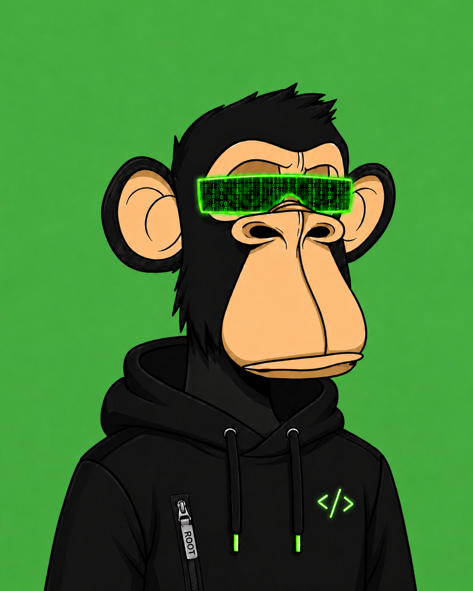

<!-- Header principal -->
<h1 align="center">Álvaro Ruiz Gutiérrez</h1>

<!-- Avatar circular -->

  

  <b>Software Engineering | Pentester Junior | OSCP | OSCP+ | eCPPT | eJPT</b>

<!-- Animación de typing -->

  

  
  
  

---

## 🧠 Sobre mí

<table>
<tr>
<td>

- 👨‍💻 **Ingeniero Informático del Software** por la **Universidad de Sevilla**.
- 🛠️ Base sólida en **programación, desarrollo web, backend, frontend y arquitectura de software**.
- 🚀 Experiencia creando proyectos con **React, TypeScript, Python, FastAPI, Java, Spring Boot y Docker**.
- 🔐 Enfoque progresivo hacia **ciberseguridad ofensiva**, especialmente **pentesting web**, **Active Directory**, **WiFi** y auditoría técnica.
- 🧪 He trabajado en laboratorios técnicos, máquinas vulnerables, entornos Linux/Windows y proyectos de auditoría.
- 📚 Certificaciones: **OSCP, OSCP+, eCPPT, eJPT, CCST Cybersecurity e IT Specialist - Cybersecurity**.
- 🎯 Buscando crecer como **Software Engineer** con mentalidad de seguridad y como futuro **Pentester / Red Team Junior**.

</td>
<td>
  
</td>
</tr>
</table>

---

## 🏆 Trofeos de GitHub

  

---

## 🛠️ Tech Stack

### **Lenguajes, Frameworks & Desarrollo**

  

### **Software Engineering**

  
  
  
  

### **Ciberseguridad & Pentesting**

  
  
  
  
  
  

---

## 🎓 Certificaciones

  
  
  
  
  
  

---

## 🚀 Proyectos Destacados

  <!-- Portfolio -->
  

  🧑‍💻 Web personal tipo terminal para centralizar proyectos, writeups, certificaciones y contacto.  
   
  <b>Stack:</b> React · TypeScript · Vite · CSS · GitHub Pages

  <!-- AD-Hacking -->
  

  🛡️ Plataforma para registrar hallazgos, evidencias y entidades durante auditorías autorizadas de Active Directory.  
   
  <b>Stack:</b> FastAPI · Python · React · TypeScript · Vite · PostgreSQL · Docker

  <!-- TFG -->
  

  📘 Trabajo Fin de Grado centrado en el diseño de una metodología de auditoría de ciberseguridad aplicada a PYMEs.  
   
  <b>Áreas:</b> NIST · auditoría técnica · análisis de riesgos · TI/OT · documentación profesional

  <!-- IA -->
  

  🤖 Proyecto académico de Inteligencia Artificial aplicado a planificación de rutas para robótica móvil.  
   
  <b>Algoritmos:</b> Q-Learning · Monte Carlo · SARSA · Jupyter Notebook · LaTeX

  <!-- CriptoCash -->
  

  💸 Sistema centralizado de criptomonedas con firmas digitales, validación de monedas y prevención de doble gasto.  
   
  <b>Stack:</b> Python · SQLite · Tkinter · ECDSA · SHA-256 · NetworkX

  <!-- Inventario -->
  

  📦 Aplicación full-stack para gestión de inventario, ventas, ingresos, gastos, productos y control de stock.  
   
  <b>Stack:</b> React · JavaScript · Spring Boot · MySQL

---

## 📊 Estadísticas de GitHub

---

## 📫 Conéctate conmigo

  
  
  

---

  <i>Software Engineering first. Security mindset always.</i>

