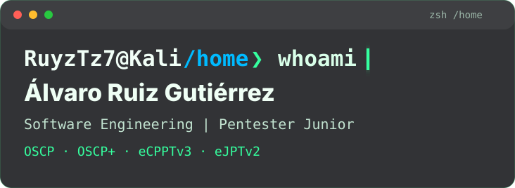
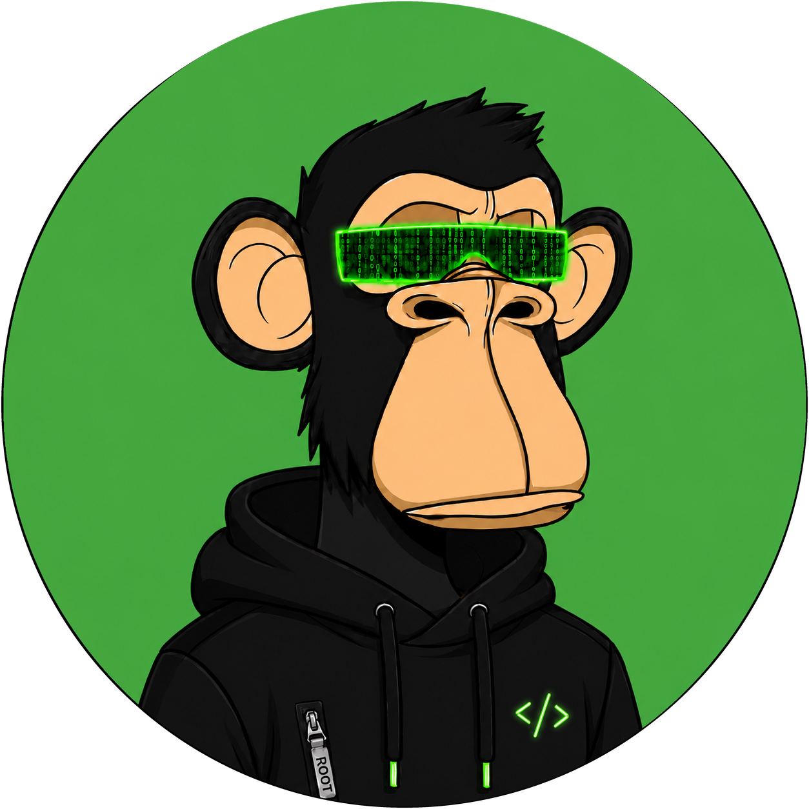
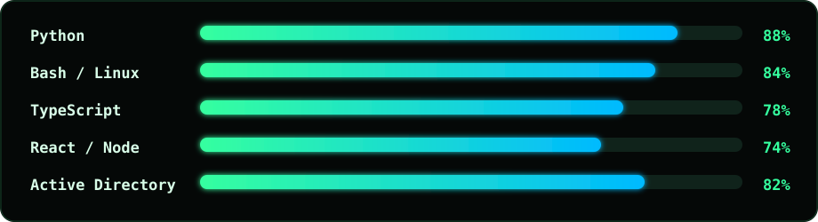

<p align="center">
  
</p>


<p align="center">
  
</p>

<br />

<table>
  <tr>
    <td width="190" align="center">
      
    </td>
    <td>
      <h3>root@github:~$ whoami</h3>
      <p>
        Soy <strong>Álvaro Ruiz Gutiérrez</strong>, Ingeniero del Software por la Universidad de Sevilla y
        <strong>Pentester Junior</strong>.
      </p>
    </td>
  </tr>
</table>

```bash
RuyzTz7@Kali /home ❯ cat focus.txt
> Offensive security con cabeza: enumerar, entender, explotar, documentar.
> Código que sirva de verdad: claro, mantenible y con intención.
> Aprender en público: writeups, notas y proyectos que dejan rastro.
```

## ./skills

<p>
  
</p>

<p align="center">
  
</p>

| Área | Qué estoy construyendo |
| --- | --- |
| `pentesting` | Active Directory, enumeración, explotación, escalada de privilegios y reporting |
| `software` | Proyectos full-stack, automatización, scripting y herramientas útiles |
| `labs` | Hack The Box, máquinas, notas técnicas y metodología de resolución |
| `research` | Apuntes, recursos y preparación de certificaciones ofensivas |

## ./certificaciones

<table>
  <tr>
    <td align="center" width="25%">
      <a href="https://help.offsec.com/hc/en-us/articles/4826237411732-Digital-certification-FAQ">
        
      </a>
    </td>
    <td align="center" width="25%">
      <a href="https://help.offsec.com/hc/en-us/articles/4826237411732-Digital-certification-FAQ">
        
      </a>
    </td>
    <td align="center" width="25%">
      <a href="https://ine.com/digital-badges">
        
      </a>
    </td>
    <td align="center" width="25%">
      <a href="https://ine.com/digital-badges">
        
      </a>
    </td>
  </tr>
</table>

## ./proyectos_destacados

<table>
  <tr>
    <td width="50%">
      <h3><a href="https://github.com/alvruigut/AD-Hacking">AD-Hacking</a></h3>
      <p>Laboratorio y recursos para practicar ataques y defensa en entornos Active Directory.</p>
    </td>
    <td width="50%">
      <h3><a href="https://github.com/alvruigut/TFG">TFG</a></h3>
      <p>Trabajo académico y documentación técnica de Ingeniería del Software.</p>
    </td>
  </tr>
  <tr>
    <td width="50%">
      <h3><a href="https://github.com/alvruigut/IA-AprendizajePorRefuerzo">IA-AprendizajePorRefuerzo</a></h3>
      <p>Experimentos con aprendizaje por refuerzo y notebooks de investigación.</p>
    </td>
    <td width="50%">
      <h3><a href="https://github.com/alvruigut/Juego-Robot">Juego-Robot</a></h3>
      <p>Proyecto en Python orientado a lógica, simulación y resolución de problemas.</p>
    </td>
  </tr>
</table>

## ./contact

<p align="center">
  <a href="https://alvruigut.github.io/"></a>
  &nbsp;&nbsp;&nbsp;
  <a href="https://www.linkedin.com/in/%C3%A1lvaro-ruiz-guti%C3%A9rrez-515684314/"></a>
  &nbsp;&nbsp;&nbsp;
  <a href="mailto:alvarorugu7@gmail.com"></a>
</p>
