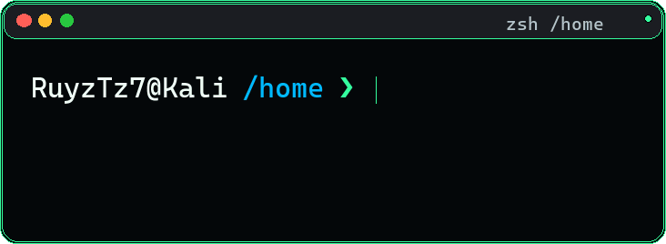
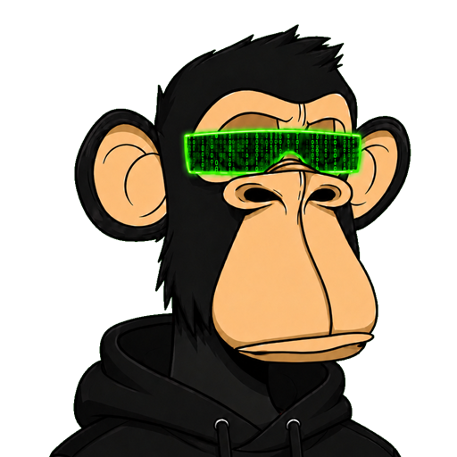

---

  

---

  

---

  

---

<h3>Languages & Tools</h3>

<table>
<tr>
<td valign="top">

<table>
<tr>
<td></td>
<td><b>Python</b></td>
<td>▰▰▰▰▰▰▰▰▱▱</td>
</tr>
<tr>
<td></td>
<td><b>Java</b></td>
<td>▰▰▰▰▰▰▰▱▱▱</td>
</tr>
<tr>
<td></td>
<td><b>Bash</b></td>
<td>▰▰▰▰▰▰▰▰▱▱</td>
</tr>
<tr>
<td></td>
<td><b>PowerShell</b></td>
<td>▰▰▰▰▰▱▱▱▱▱</td>
</tr>
<tr>
<td></td>
<td><b>TypeScript</b></td>
<td>▰▰▰▰▱▱▱▱▱▱</td>
</tr>
<tr>
<td></td>
<td><b>JavaScript</b></td>
<td>▰▰▰▰▰▰▱▱▱▱</td>
</tr>
<tr>
<td></td>
<td><b>React</b></td>
<td>▰▰▰▰▰▰▱▱▱▱</td>
</tr>
</table>

</td>
<td valign="top">

<table>
<tr>
<td></td>
<td><b>LaTeX</b></td>
<td>▰▰▰▰▰▰▰▰▱▱</td>
</tr>
<tr>
<td></td>
<td><b>CSS</b></td>
<td>▰▰▰▰▰▱▱▱▱▱</td>
</tr>
<tr>
<td></td>
<td><b>Spring Boot</b></td>
<td>▰▰▰▰▰▰▰▱▱▱</td>
</tr>
<tr>
<td></td>
<td><b>Flutter</b></td>
<td>▰▰▰▰▱▱▱▱▱▱</td>
</tr>
<tr>
<td></td>
<td><b>Docker</b></td>
<td>▰▰▰▰▰▰▰▱▱▱</td>
</tr>
<tr>
<td></td>
<td><b>Linux</b></td>
<td>▰▰▰▰▰▰▰▰▰▱</td>
</tr>
<tr>
<td></td>
<td><b>C</b></td>
<td>▰▰▰▰▰▰▱▱▱▱</td>
</tr>
</table>

</td>
</tr>
</table>

---

  

---

  
  &nbsp;&nbsp;&nbsp;
  
  &nbsp;&nbsp;&nbsp;
  
  &nbsp;&nbsp;&nbsp;
  

